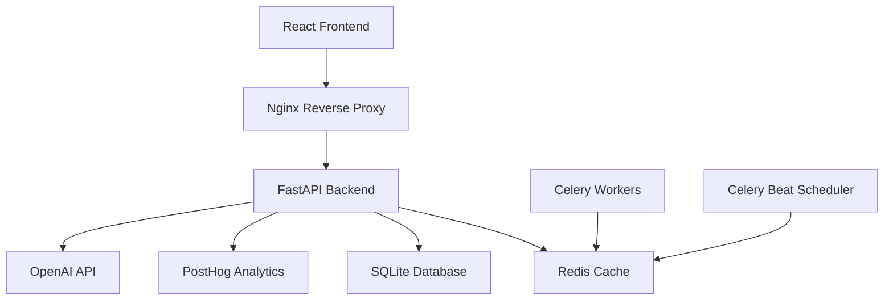

# 🚀 Onboarding Analyzer - Advanced Enterprise Analytics Platform

## 📋 Overview

A next-generation funnel analytics platform powered by AI agents, machine learning, and real-time insights. Features advanced behavior segmentation, predictive analytics, and autonomous optimization recommendations.

## ✨ Key Features

### 🤖 **AI-Powered Analytics**
- **Autonomous AI Agents**: Self-improving recommendation engine
- **ML-Based User Segmentation**: Behavioral clustering with unsupervised learning
- **Predictive Insights**: Churn prediction and conversion forecasting
- **Real-time Anomaly Detection**: Automated alert system

### 📊 **Advanced Analytics**
- **Cohort Analysis**: Retention tracking across time periods
- **Session Replays**: Drop-off point analysis and user journey mapping
- **Comprehensive Reporting**: Executive-level insights and KPIs
- **Interactive Dashboards**: Glassmorphism UI with real-time updates

### 🔧 **Enterprise Features**
- **Real-time Collaboration**: Multi-user dashboards with live updates
- **Export Capabilities**: PDF reports, CSV data, and API integrations
- **Performance Monitoring**: System health and optimization metrics
- **Security**: Role-based access control and data encryption

## 🛠 Installation & Setup

### Prerequisites

- **Docker & Docker Compose** (recommended)
- **Node.js 18+** and **Python 3.11+** (for local development)
- **PostHog Account** with project API key
- **OpenAI API Key** (for AI agents)

### 📦 Quick Start with Docker

1. **Clone and Configure**
```bash
git clone <your-repo-url>
cd Onboarding_analyzer
cp .env.development .env
# Edit .env with your API keys
```

2. **Deploy with Docker Compose**
```bash
# Development
docker-compose up --build

# Production (with SSL and advanced features)
docker-compose --profile production up -d
```

3. **Access the Application**
- Frontend: http://localhost
- Backend API: http://localhost/api
- Health Check: http://localhost/health

### 🔧 Local Development Setup

#### Backend Setup
```bash
cd backend
python -m venv venv
source venv/bin/activate  # Windows: venv\Scripts\activate
pip install -r requirements.txt
uvicorn app:app --reload --port 8000
```

#### Frontend Setup
```bash
cd frontend
npm install
npm start
```

## 🌐 Environment Configuration

### Development (.env.development)
```bash
ENVIRONMENT=development
POSTHOG_PROJECT_API_KEY=your_posthog_key
OPENAI_API_KEY=your_openai_key
REACT_APP_BACKEND_API_URL=http://127.0.0.1:8000
```

### Production (.env.production)
```bash
ENVIRONMENT=production
POSTHOG_PROJECT_API_KEY=your_posthog_key
OPENAI_API_KEY=your_openai_key
SECRET_KEY=your_32_char_secret_key
REDIS_PASSWORD=secure_redis_password
CORS_ORIGINS=https://yourdomain.com
REACT_APP_BACKEND_API_URL=https://api.yourdomain.com
```

## 🏗 Architecture

### System Components



### Data Flow
1. **Frontend** → Glassmorphism UI with real-time updates
2. **API Gateway** → FastAPI with automatic OpenAPI documentation
3. **ML Pipeline** → Scikit-learn for clustering and XGBoost for predictions
4. **AI Agents** → LangChain + OpenAI for autonomous insights
5. **Caching Layer** → Redis for real-time performance
6. **Background Jobs** → Celery for data processing

## 🚀 Production Deployment

### Cloud Deployment Options

#### 1. **AWS ECS/Fargate**
```bash
# Build and push images
docker build -t your-registry/onboarding-backend ./backend
docker build -t your-registry/onboarding-frontend ./frontend
docker push your-registry/onboarding-backend
docker push your-registry/onboarding-frontend

# Deploy using ECS CLI or Terraform
```

#### 2. **Google Cloud Run**
```bash
gcloud builds submit --tag gcr.io/PROJECT-ID/onboarding-analyzer
gcloud run deploy --image gcr.io/PROJECT-ID/onboarding-analyzer
```

#### 3. **Digital Ocean App Platform**
```yaml
# .do/app.yaml
name: onboarding-analyzer
services:
- name: frontend
  source_dir: /frontend
  github:
    repo: your-username/onboarding-analyzer
    branch: main
  run_command: nginx -g "daemon off;"
  environment_slug: docker
  instance_count: 1
  instance_size_slug: basic-xxs
```

### SSL/HTTPS Setup

1. **Certbot for Let's Encrypt**
```bash
# Add SSL certificates
certbot certonly --webroot -w /var/www/certbot -d yourdomain.com
```

2. **Update Nginx Configuration**
```nginx
server {
    listen 443 ssl http2;
    server_name yourdomain.com;
    
    ssl_certificate /etc/letsencrypt/live/yourdomain.com/fullchain.pem;
    ssl_certificate_key /etc/letsencrypt/live/yourdomain.com/privkey.pem;
    
    # ... rest of configuration
}
```

## 📊 Monitoring & Observability

### Health Checks
- **Backend**: `GET /health` - API health and PostHog connection
- **Frontend**: `GET /health` - Application availability
- **Redis**: Built-in health check with connection test

### Metrics Collection
- **Prometheus Metrics**: `/metrics` endpoint for system monitoring
- **Application Logs**: Structured logging with correlation IDs
- **Performance Monitoring**: Response times and error rates

### Alerting
```python
# Example Prometheus alert rules
groups:
- name: onboarding_analyzer
  rules:
  - alert: HighErrorRate
    expr: rate(http_requests_total{status=~"5.."}[5m]) > 0.1
    for: 2m
    annotations:
      summary: "High error rate detected"
```

## 🔒 Security

### API Security
- **CORS Protection**: Configurable allowed origins
- **Rate Limiting**: Built-in request throttling
- **Input Validation**: Pydantic models with strict typing
- **SQL Injection Prevention**: SQLAlchemy ORM with parameterized queries

### Infrastructure Security
- **Non-root Docker Users**: Security best practices
- **Secrets Management**: Environment variables and Docker secrets
- **Network Isolation**: Docker networks and firewall rules
- **HTTPS Enforcement**: SSL/TLS encryption for all traffic

## 🧪 Testing

### Unit Tests
```bash
cd backend
pytest tests/ -v --coverage

cd frontend
npm test -- --coverage
```

### Integration Tests
```bash
# Run full stack tests
docker-compose -f docker-compose.test.yml up --abort-on-container-exit
```

### Load Testing
```bash
# Using Artillery.js
artillery run load-test.yml
```

## 🔧 Maintenance

### Database Migrations
```bash
# Apply database migrations
docker-compose exec backend alembic upgrade head
```

### Backup & Recovery
```bash
# Database backup
docker-compose exec backend python backup_script.py

# Redis backup
docker-compose exec redis redis-cli --rdb /data/dump.rdb
```

### Updates & Scaling
```bash
# Rolling updates
docker-compose pull
docker-compose up -d --no-deps backend frontend

# Horizontal scaling
docker-compose up --scale celery_worker=3
```

## 📈 Performance Optimization

### Frontend Optimization
- **Code Splitting**: Lazy loading of dashboard components
- **Bundle Analysis**: Webpack analyzer for optimization
- **CDN Integration**: Static asset delivery
- **Service Worker**: Offline capability and caching

### Backend Optimization
- **Database Indexing**: Optimized queries for large datasets
- **Connection Pooling**: Redis and database connection management
- **Caching Strategy**: Multi-layer caching with TTL policies
- **Background Processing**: Async task execution

## 🤝 Contributing

### Development Workflow
1. Fork the repository
2. Create feature branch: `git checkout -b feature/amazing-feature`
3. Commit changes: `git commit -m 'Add amazing feature'`
4. Push branch: `git push origin feature/amazing-feature`
5. Open Pull Request

### Code Standards
- **Backend**: Black formatting, flake8 linting, type hints
- **Frontend**: ESLint, Prettier, JSDoc comments
- **Documentation**: README updates for new features

## 📞 Support

### Getting Help
- **Documentation**: Check this README and inline comments
- **Issues**: GitHub Issues for bug reports and feature requests
- **Discussions**: GitHub Discussions for questions and ideas

### Enterprise Support
For enterprise deployments, custom integrations, and dedicated support:
- 📧 Email: support@yourcompany.com
- 💬 Slack: #onboarding-analyzer-support
- 📅 Calendar: Schedule consultation call

## 📄 License

This project is licensed under the MIT License - see the [LICENSE](LICENSE) file for details.

## 🎉 Acknowledgments

- **PostHog Team** - Amazing analytics platform
- **OpenAI** - GPT models for AI agents
- **FastAPI Community** - Excellent Python web framework
- **React Ecosystem** - Modern frontend development tools

---


Built with ❤️ for data-driven teams who want to optimize their onboarding funnels with AI-powered insights.